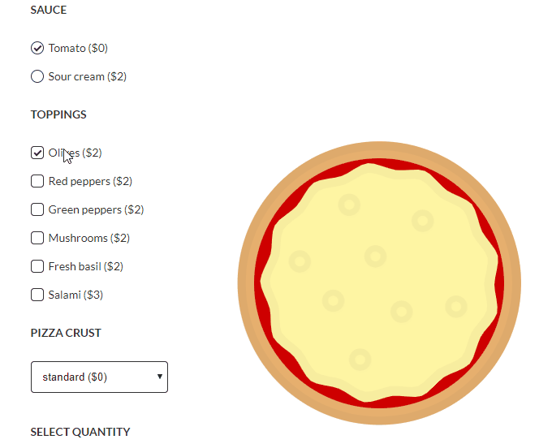

<p align="center">
</a>
</p>
<br>
  
# Pizzeria

Website of a pizzeria restaurant where you can order a personalised dish by selecting ingredients and adding it to your basket. You can also book a table. Object-oriented programming project.

[:sparkles: Published version on Heroku](https://thawing-forest-64372.herokuapp.com/)
## Tech Stack

* HTML
* CSS
* JavaScript
* AJAX

  
## Lessons

* how to create OOP project
* drop-down panel with options for individual products
* each product option can change its price
* the products ordered are placed in a basket
* possibility to remove a product from the basket, change quantity and edit item options
* use the Handlebars template
* use DOM elements
* use AJAX and API

## Room for Improvement

* develop functionality for editing products in the shopping basket
* add order validation
* add *sticky* header 

  
## Run Locally

Install dependencies

```bash
  npm install
```

Start the server

```bash
  npm run start
```

  
## Authors

:woman: [@marcelaos](https://github.com/marcela-os)

  